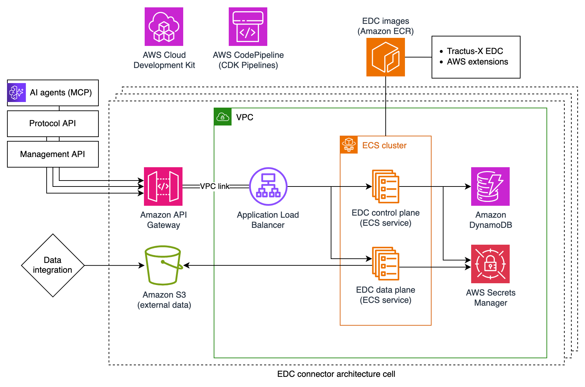

# Dataspace Connector on AWS

🚀 Deploy a production-ready Dataspace Connector for [Catena-X](https://catena-x.net/) on AWS with a single command.

To participate in secure, sovereign data sharing through the Catena-X data space, member organizations must host a [*Dataspace Connector*](https://eclipse-tractusx.github.io/docs-kits/category/connector-kit). This open-source project comes with just that:

* Production-ready deployment blueprint for data space connectors on AWS, following AWS best practices and Catena-X learnings made since 2023
* Customization for [Tractus-X EDC](https://github.com/eclipse-tractusx/tractusx-edc), the mature Eclipse Dataspace Components (EDC) connector implementation of the Eclipse Tractus-X project, to leverage available AWS service integrations with [Amazon S3](https://aws.amazon.com/s3/) and [AWS Secrets Manager](https://aws.amazon.com/secrets-manager/)
* EDC extension for [Amazon DynamoDB](https://aws.amazon.com/dynamodb/) as alternative to a PostgreSQL-compatible database for control plane persistance

The goal is to provide easy access to production-ready connector deployments within minutes, that leverage security, reliability and scale of the AWS Cloud in a cost-efficient manner.

## Quick Start

**Prerequisites:** `corretto@17`, `docker`, `cdk`, `npm` and `node@24`

Adjust the EDC and CDK configuration in [`environments.ts`](https://github.com/awslabs/dataspace-connector-on-aws/blob/main/cdk/lib/config/environments.ts) as needed. Provide your Catena-X membership information and technical user as outlined in the Cofinity-X Portal.

> [!IMPORTANT]
> To use this open-source project, your company or organization must be onboarded to the Catena-X data space. Instructions on how to get started with your Catena-X journey [can be found here](https://catena-x.net/ecosystem/onboarding/).

```bash
~ ./deploy.sh

...
Outputs:
DataspaceConnectorStack.EdcApiDataPlaneApiEndpoint     = https://<api-id>.execute-api.<aws-region>.amazonaws.com/data/
DataspaceConnectorStack.EdcApiDspApiEndpoint           = https://<api-id>.execute-api.<aws-region>.amazonaws.com/dsp/
DataspaceConnectorStack.EdcApiManagementApiEndpoint    = https://<api-id>.execute-api.<aws-region>.amazonaws.com/management/
DataspaceConnectorStack.EdcApiObservabilityApiEndpoint = https://<api-id>.execute-api.<aws-region>.amazonaws.com/status/
DataspaceConnectorStack.EdcOauthClientSecretArn        = arn:aws:secretsmanager:<aws-region>:<account-id>:secret:edc.iam.sts.oauth.client.secret
```

After deployment, navigate to the [AWS Secrets Manager console](https://console.aws.amazon.com/secretsmanager/listsecrets) and update `EdcOauthClientSecretArn`'s value with your OAuth client secret obtained from the Cofinity-X Portal.

✨ That's it! You can now interact with your EDC's management API to start creating contract offers or browse a data space participant's catalog. 

## Architecture



## Learn More

* [Minimum Viable Dataspace on AWS](https://github.com/aws-samples/minimum-viable-dataspace-for-catenax)
* [AWS-specific service integrations for EDC](https://github.com/eclipse-edc/Technology-Aws)
* [AWS joins Catena-X, underscoring commitment to transparency and collaboration in the global Automotive and Manufacturing Industries](https://aws.amazon.com/blogs/industries/aws-joins-catena-x/)
* [Rapidly experimenting with Catena-X data space technology on AWS](https://aws.amazon.com/blogs/industries/rapidly-experimenting-with-catena-x-data-space-technology-on-aws/)

## Configuration

### Custom Domain (Optional)

By default, the EDC APIs are exposed via auto-generated API Gateway URLs (e.g. `https://<api-id>.execute-api.<region>.amazonaws.com/dsp/`). To use your own domain instead, you need:

1. A [Route 53 hosted zone](https://docs.aws.amazon.com/Route53/latest/DeveloperGuide/CreatingHostedZone.html) for your domain
2. An [ACM certificate](https://docs.aws.amazon.com/acm/latest/userguide/gs-acm-request-public.html) in `us-east-1` (required for edge-optimized API Gateway endpoints, regardless of your stack's deployment region)

Add these three values to your configuration in [`environments.ts`](cdk/lib/config/environments.ts):

```typescript
certificateArn: "arn:aws:acm:us-east-1:<account-id>:certificate/<certificate-id>",
domainName: "edc.example.com",
hostedZoneId: "Z0123456789ABCDEFGHIJ",
```

All three values are required when enabling a custom domain. This will:
- Create an API Gateway custom domain with TLS 1.2
- Create a Route 53 A record pointing to the API Gateway
- Disable the default `execute-api` endpoints
- Map all EDC APIs as base paths: `/status`, `/management`, `/dsp`, `/data`
- Automatically configure the EDC's DSP callback and data plane public URLs to use your domain

### Management API Authentication

This project uses a dual-layer security model for the EDC's Management API:

1. **API Gateway IAM Authorization** - All Management API endpoints require AWS SigV4 signed requests with valid IAM credentials. This is configured via `AWS_IAM` authorization in the API Gateway OpenAPI specification and controlled by the `managementApiPrincipals` setting in `environments.ts`.

2. **EDC API Key** (Optional) - The `managementApiAuthKey` configuration can add an additional `x-api-key` header requirement at the EDC level. By default, this is set to an empty string (`""`) since API Gateway IAM authorization already provides strong authentication.

### Policy Monitor State Machine

The `controlPlanePolicyMonitorIteration` configuration controls how frequently the EDC policy monitor checks for state transitions in contract negotiations, policy evaluations, and transfer processes. Each polling cycle generates read requests against DynamoDB tables (ContractNegotiation, ContractAgreement, Policy, TransferProcess). With DynamoDB's pay-per-request pricing model, the polling frequency therefore directly affects operational costs.

This project sets `controlPlanePolicyMonitorIteration` to 10 minutes (600000ms) by default, to minimize DynamoDB read costs in typical usage scenarios. This is longer than EDC's default of 1 second, trading faster state transition detection for lower operational costs.

## Considerations

The maximum payload size for [Amazon API Gateway](https://aws.amazon.com/api-gateway/) REST APIs is 10 MB (see [service quotas](https://docs.aws.amazon.com/apigateway/latest/developerguide/api-gateway-execution-service-limits-table.html)). This means a single EDC data transfer can't exceed 10 MB when data is pushed to the EDC's data plane API behind API Gateway.

This does not apply to [*Consumer Pull*](https://eclipse-edc.github.io/documentation/for-adopters/control-plane/#flow-types) scenarios. A potential mitigation is to store larger objects on Amazon S3, using [presigned URLs](https://docs.aws.amazon.com/AmazonS3/latest/userguide/ShareObjectPreSignedURL.html) to only push a temporary link to requested data to a consumer.

## EDC Extensions and Service Options

The EDC connector consists of two main components: a **Control Plane** that manages data sharing agreements and policies, and a **Data Plane** that handles the actual data transfer. By default, EDC requires you to deploy and manage supporting infrastructure like databases and secret stores yourself. AWS offers managed alternatives that reduce operational complexity and provide enterprise-grade security and reliability out of the box.

This deployment leverages AWS serverless services where possible, to minimize operational heavy-lifting while maintaining EDC's full functionality.

### Control Plane

**Secrets Management:**
Stores private keys, certificates, and API credentials for secure communication and data plane authentication.
* **[AWS Secrets Manager](https://aws.amazon.com/secrets-manager/)** (used in this deployment) - Fully managed secrets management service
* **Vault** (self-managed alternative) - Requires separate deployment and maintenance

**Database:**
Stores contract negotiations, agreements, policies, transfer processes, and asset metadata.
* **[Amazon DynamoDB](https://aws.amazon.com/dynamodb/)** (used in this deployment) - Serverless NoSQL database with pay-per-request pricing
* **[Amazon Aurora PostgreSQL](https://aws.amazon.com/rds/aurora/)** (managed alternative) - Fully managed relational database for PostgreSQL
* **PostgreSQL** (self-managed alternative) - Requires separate deployment and maintenance

### Data Plane

**Secrets Management:**
Stores credentials needed to access data sources and destinations during transfer operations.
* **AWS Secrets Manager** (used in this deployment)
* **Vault** (self-managed alternative)

**Data Transfer:**
* **[Amazon S3](https://aws.amazon.com/s3/)** - Object storage with presigned URL support
* **Amazon DynamoDB** - NoSQL database as data source/destination
* **HTTP/HTTPS** (default EDC protocol) - Direct data transfer via HTTP endpoints

## Backlog / Ideas 💡

* Upgrade to Tractus-X EDC 0.11.x (Saturn)
* Configurable switch between DynamoDB and Aurora PostgreSQL for control plane persistance
* Include examples for EDC assets, such as OAuth 2.0 and S3
* Configurable control and data plane auto-scaling on ECS Service level
* Configurable prod/non-prod switch with 1/ 1 NAT GW, 2/ disabled "edc.policy.monitor.state-machine.iteration-wait-millis", 3/ minimal resources, 4/ DynamoDB only, 5/ Fargate Spot
* Create data plane extension to serve DynamoDB data as EDC asset
* Allow for deployment of entire [Tractus-X Hausanschluss](https://github.com/eclipse-tractusx/tractus-x-umbrella/blob/main/docs/user/common/guides/hausanschluss-bundles.md) bundles, instead of Tractus-X EDC only

## Security

See [CONTRIBUTING](CONTRIBUTING.md#security-issue-notifications) for more information.

## License

This project is licensed under the Apache-2.0 License.
