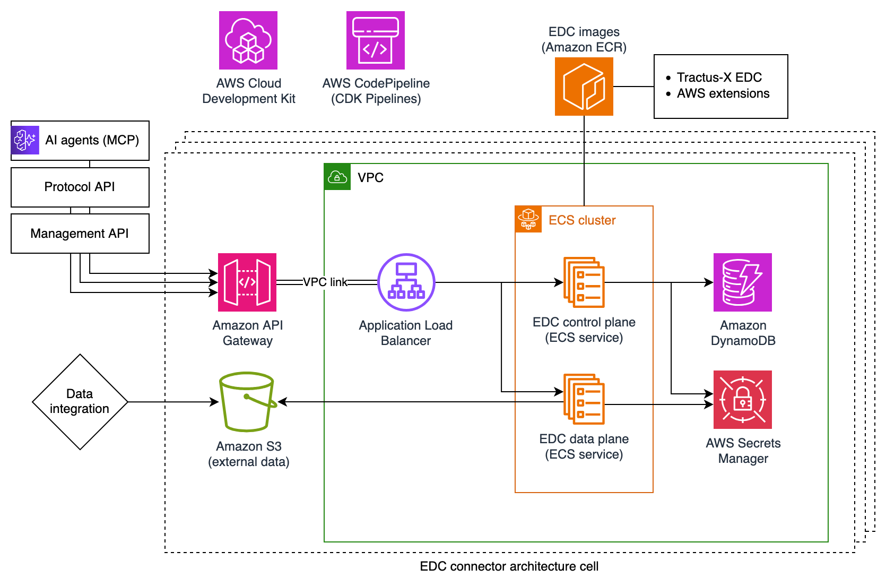

# Dataspace Connector on AWS

🚀 Deploy and manage a fleet of Dataspace Connectors for [Catena-X](https://catena-x.net/) on production-ready AWS infrastructure — from a single connector to hundreds, all managed through configuration.

To participate in secure, sovereign data sharing through the Catena-X data space, member organizations must host a [*Dataspace Connector*](https://eclipse-tractusx.github.io/docs-kits/category/connector-kit). This open-source project provides:

* Production-ready multi-connector deployment on AWS infrastructure, following AWS best practices
* GitOps-driven operations using CDK Pipelines — add or remove connectors by editing YAML files in Git
* Customization for [Tractus-X EDC](https://github.com/eclipse-tractusx/tractusx-edc), with AWS service integrations for [Amazon S3](https://aws.amazon.com/s3/), [AWS Secrets Manager](https://aws.amazon.com/secrets-manager/), and [Amazon DynamoDB](https://aws.amazon.com/dynamodb/)
* Cost-optimized serverless infrastructure targeting <$25/month per connector at scale
* AI-assisted connector management via an included [MCP server](mcp/) and guided [Kiro Power](kiro-power/) workflows for deployment, validation, and operations

> [!IMPORTANT]
> To use this project, your organization must be onboarded to the Catena-X data space. Instructions on how to get started [can be found here](https://catena-x.net/ecosystem/onboarding/). Additionally, operating a connector in the Catena-X production environment requires your organization to pass a [conformity assessment](https://catena-x.net/ecosystem/certification/) conducted by an accredited Conformity Assessment Body (CAB). "Production-ready" in this project refers to AWS infrastructure (fault tolerance, security, observability) — not Catena-X certification status.

## Architecture



## Quick Start

### Prerequisites

* Java 17 (Amazon Corretto recommended)
* Docker or [Finch](https://github.com/runfinch/finch) container runtime
* Node.js 24+
* AWS CDK CLI (`npm install -g aws-cdk`)
* AWS CLI configured with credentials for your target account
* A [Cofinity-X](https://portal.cofinity-x.com/) account for your Catena-X–onboarded organization, with portal access

### How It Works

Deployment is fully GitOps-driven via AWS CDK Pipelines. You run `./deploy.sh` once to create the pipeline and a configuration repository, then manage your entire connector fleet by editing YAML files in that repo:

* **Add a connector** — add a `connector-<id>.yaml` file; the pipeline provisions its infrastructure, reads its identity credentials from the Cofinity-X Portal, and registers it for discovery.
* **Remove a connector** — delete its YAML file; the pipeline deregisters it from the portal and tears down its stack.
* **Upgrade the connector software** — bump `appVersion` in `pipeline.yaml`; the pipeline rebuilds and redeploys all connectors.

### Deploy the Pipeline

**1. Create the portal admin technical user.** In the Cofinity-X Portal, create a technical user with the **Offer Management** and **Dataspace Discovery** roles. The pipeline uses it to read per-connector credentials and register connectors.

**2. Run the deploy script:**

```bash
export AWS_PROFILE=<your-profile>
export AWS_REGION=eu-central-1
./deploy.sh
```

This bootstraps the account, deploys the pipeline stack, creates a CodeCommit configuration repository (`dataspace-connector-config`) pre-populated with template YAML files, and prompts for the portal admin user's Client ID and Secret — stored in AWS Secrets Manager, never in CloudFormation.

**3. Configure and push.** Clone the config repo, edit the YAML files (see [Configuration](#configuration)), and push to trigger the first deployment:

```bash
git clone codecommit::eu-central-1://<your-profile>@dataspace-connector-config
cd dataspace-connector-config
# edit deployment.yaml and connectors/*.yaml
git add -A && git commit -m "Initial configuration" && git push origin main
```

All subsequent changes flow through Git pushes to the config repository.

## AI-Assisted Connector Management

This project includes tooling for AI-assisted deployment and operation:

* **[MCP Server](mcp/)** — A Model Context Protocol server with 18 tools for interacting with the EDC Management API. Create assets, negotiate contracts, transfer data, and troubleshoot — all through natural language.

* **[Kiro Power](kiro-power/)** — Guided workflows for [Kiro](https://kiro.dev) that walk you through deploying your connector and validating end-to-end data exchange, including S3 loopback testing.

## Configuration

The configuration repository has three parts:

```
your-config-repo/
├── pipeline.yaml              # Pipeline settings
├── deployment.yaml            # Shared infrastructure + portal integration
└── connectors/
    ├── connector-alpha.yaml   # One file per connector
    ├── connector-bravo.yaml
    └── connector-charlie.yaml
```

### `pipeline.yaml`

```yaml
appRepo: awslabs/dataspace-connector-on-aws   # App source (public GitHub)
appVersion: main                              # Git tag, branch, or commit hash
configSource: codecommit                      # "codecommit" (auto-created) or "github"
configRepoName: dataspace-connector-config    # Repository name
# connectionArn: "arn:aws:codestar-connections:..."  # Required for GitHub
requireApproval: false                        # Optional manual gate before deploy
```

### `deployment.yaml`

Shared infrastructure plus Cofinity-X Portal integration. The `portal.identity` values are organization-wide (shared across all connectors) and come from the portal's "Configure Your Connector" dialog — see [Obtaining EDC Identity Credentials from the Cofinity-X Portal](docs/obtaining-edc-identity-credentials.md).

```yaml
profile: development                 # "development" (1 NAT, Fargate Spot) or "production" (2 NATs, On-Demand)
vpcIpAddresses: "10.0.0.0/20"
containerInsights: true
managementApiPrincipals:
  - "arn:aws:iam::<account-id>:role/<role-name>"
observabilityApiPrincipals:
  - "arn:aws:iam::<account-id>:role/<role-name>"

# Optional custom domain (all three fields required together)
# certificateArn: "arn:aws:acm:us-east-1:<account-id>:certificate/<id>"
# domainName: "edc.example.com"
# hostedZoneId: "Z0123456789ABCDEFGHIJ"

portal:
  environment: beta                  # "beta" or "production"
  identity:
    trustedIssuer: "did:web:..."
    stsOauthTokenUrl: "https://..."
    stsDimUrl: "https://..."
    participantId: "BPNL..."
    dcpId: "did:web:..."
    didResolver: "https://..."
```

### `connectors/connector-<id>.yaml`

Each connector references a Cofinity-X **technical user** (Identity Wallet Management role) by its service account ID. The pipeline reads its OAuth credentials, populates the connector's EDC identity, stores the client secret in AWS Secrets Manager, and registers the connector for discovery — no manual steps.

```yaml
connectorId: alpha
profile: production                  # Optional per-connector override
controlPlaneCpu: 256
controlPlaneMemoryLimitMiB: 1024
dataPlaneCpu: 256
dataPlaneMemoryLimitMiB: 512
stateMachineIterationMillis: "10000"
edcStateRemovalPolicy: DESTROY       # DESTROY or RETAIN
edcTechnicalUserId: "<portal-technical-user-service-account-id>"
```

> [!IMPORTANT]
> The Cofinity-X Portal does not currently expose an API to create technical users — only human portal users (IT Admin / Company Admin) can. Create the per-connector Identity Wallet Management technical user manually in the portal, then reference its service account ID here. The pipeline automates everything else.

### Custom Domain

When all three optional fields (`certificateArn`, `domainName`, `hostedZoneId`) are provided in `deployment.yaml`, the stack creates an API Gateway custom domain with TLS 1.2, a Route 53 A record, and maps EDC APIs as base paths (`/status`, `/management`, `/protocol`, `/data`). The default `execute-api` endpoints are disabled. The ACM certificate must be in `us-east-1` regardless of stack region (API Gateway requirement for edge-optimized endpoints).

## Managing Connectors

### Adding a Connector

1. Create the per-connector technical user in the Cofinity-X Portal (Identity Wallet Management role) and note its service account ID.
2. Add `connectors/connector-<id>.yaml` referencing that ID.
3. Commit and push. The pipeline provisions the connector, stores its OAuth secret, and registers it in the portal.

### Removing a Connector

1. Delete `connectors/connector-<id>.yaml`.
2. Commit and push. The pipeline deregisters the connector from the portal and destroys its stack.

> [!NOTE]
> If the connector used `edcStateRemovalPolicy: RETAIN`, its DynamoDB table and S3 bucket are retained (not deleted) for data preservation — delete them manually if no longer needed. The manually-created portal technical user is also left in place.

## Teardown

To completely remove all deployed resources, follow these steps in order:

**1. Remove all connector YAML files** from the config repo and push. This triggers the pipeline's cleanup step, which deregisters the connectors from the portal and destroys their stacks.

**2. Delete the shared infrastructure stack:**

```bash
aws cloudformation delete-stack --stack-name Deploy-DataspaceConnectorSharedInfraStack --region <region>
```

**3. Delete the pipeline stack** (removes the pipeline, config repo, and admin secret):

```bash
aws cloudformation delete-stack --stack-name DataspaceConnectorPipelineStack --region <region>
```

## Deployment Profiles

| Setting | `development` | `production` |
|---------|--------------|--------------|
| VPC | 2 AZs, 1 NAT Gateway | 2 AZs, 2 NAT Gateways (HA) |
| Fargate | Spot (70% cheaper) | On-Demand |
| Log retention | 7 days | 30 days |

### Estimated Monthly Cost (eu-central-1)

| Connectors | `development` | `production` |
|-----------|---------------|--------------|
| 1 | ~$50/month | ~$80/month |
| 10 | ~$10/connector | ~$15/connector |
| 100 | ~$7/connector | ~$12/connector |

Baseline infrastructure cost drops significantly at scale because VPC, NAT Gateway, and ALB are shared. Per-connector cost is primarily Fargate compute + DynamoDB on-demand.

## Considerations

* **Per-connector access control:** When deploying multiple connectors, you can restrict which IAM principals can access which connector's Management API. Supports single-account, cross-account, and organization-level trust patterns — see [Management API Access Patterns](docs/management-api-access-patterns.md).
* **API Gateway payload limit:** 10 MB per request (REST API). Does not affect Consumer Pull scenarios or S3-backed data transfers.
* **Fargate Spot availability:** In `development` profile, Spot capacity constraints may cause deployment delays during updates. Retry or use `production` profile for guaranteed placement.
* **Connector ID constraints:** Must be 2–60 characters, lowercase alphanumeric + hyphens, cannot start/end with a hyphen. Used in ALB paths, DynamoDB table names, Secrets Manager prefixes, and CloudFormation stack names.

## Learn More

* [Minimum Viable Dataspace on AWS](https://github.com/aws-samples/minimum-viable-dataspace-for-catenax)
* [AWS-specific service integrations for EDC](https://github.com/eclipse-edc/Technology-Aws)
* [AWS joins Catena-X](https://aws.amazon.com/blogs/industries/aws-joins-catena-x/)
* [Rapidly experimenting with Catena-X data space technology on AWS](https://aws.amazon.com/blogs/industries/rapidly-experimenting-with-catena-x-data-space-technology-on-aws/)
* [Eclipse Tractus-X EDC](https://github.com/eclipse-tractusx/tractusx-edc)

## EDC Extensions and Service Options

The EDC connector consists of two main components: a **Control Plane** that manages data sharing agreements and policies, and a **Data Plane** that handles the actual data transfer. This deployment leverages AWS serverless services to minimize operational overhead while maintaining full EDC functionality.

### Control Plane

| Capability | This Deployment | Alternatives |
|-----------|----------------|--------------|
| Secrets Management | [AWS Secrets Manager](https://aws.amazon.com/secrets-manager/) | Vault (self-managed) |
| Database | [Amazon DynamoDB](https://aws.amazon.com/dynamodb/) (single-table design) | [Amazon Aurora PostgreSQL](https://aws.amazon.com/rds/aurora/), PostgreSQL (self-managed) |

### Data Plane

| Capability | This Deployment | Alternatives |
|-----------|----------------|--------------|
| Secrets Management | AWS Secrets Manager | Vault (self-managed) |
| Data Transfer | [Amazon S3](https://aws.amazon.com/s3/), HTTP/HTTPS | DynamoDB, custom backends |

## Backlog / Ideas 💡

* Deployment of Digital Twin Registry (DTR) or entire [Tractus-X Hausanschluss](https://github.com/eclipse-tractusx/tractus-x-umbrella/blob/main/docs/user/common/guides/hausanschluss-bundles.md)
* Configurable switch between DynamoDB and Aurora PostgreSQL for control plane persistence
* Include examples for EDC assets, such as OAuth 2.0 and S3
* Configurable control and data plane auto-scaling on ECS Service level
* Data plane extension to serve DynamoDB data as EDC asset
* Scale-to-zero for idle consumer-only connectors

## Security

See [CONTRIBUTING](CONTRIBUTING.md#security-issue-notifications) for more information.

## License

This project is licensed under the Apache-2.0 License.
