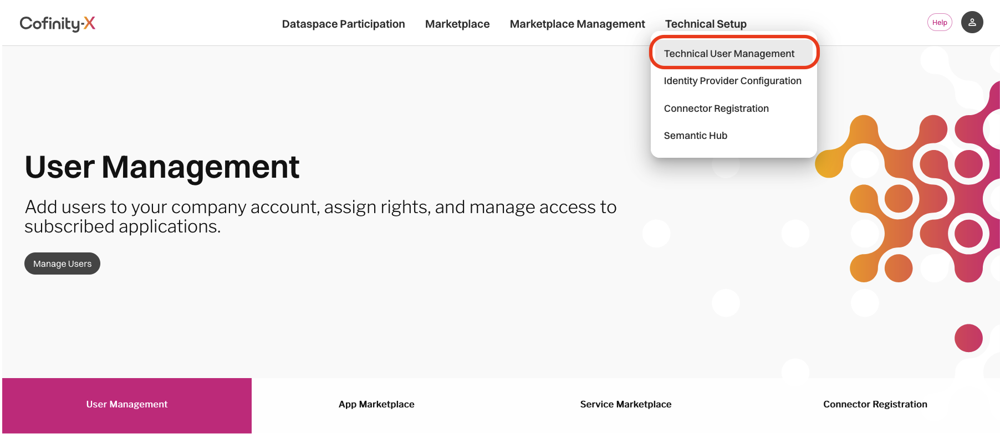
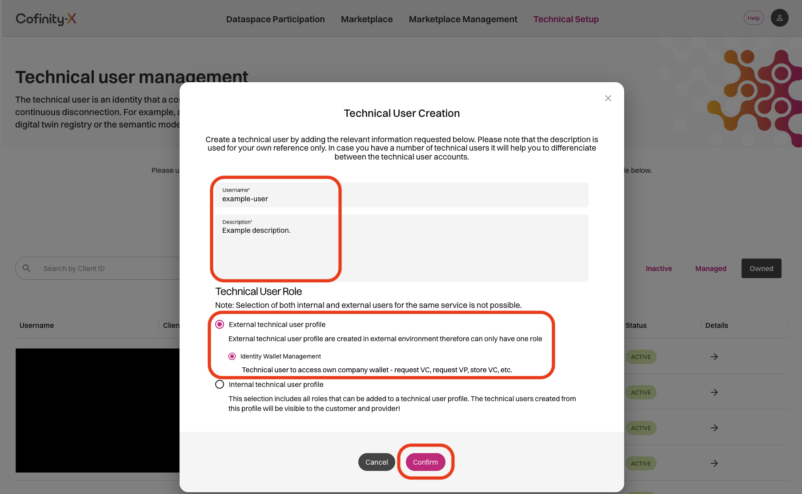
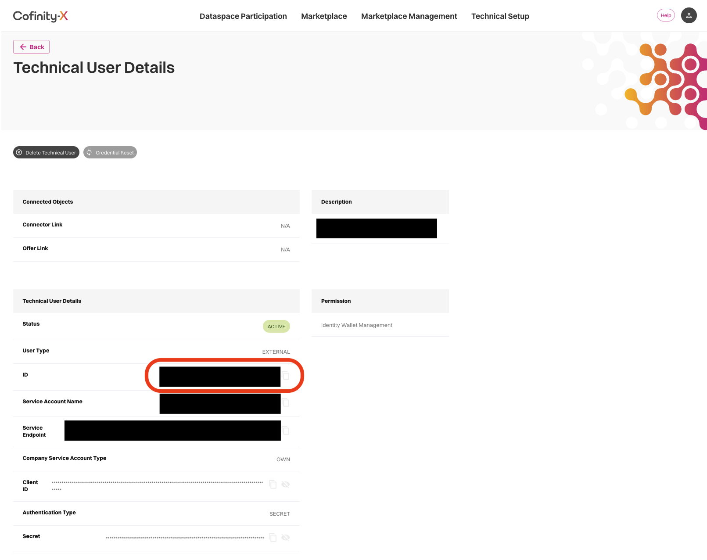
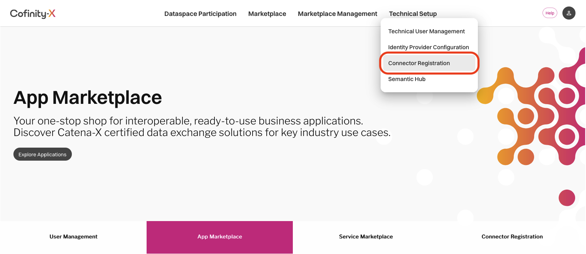
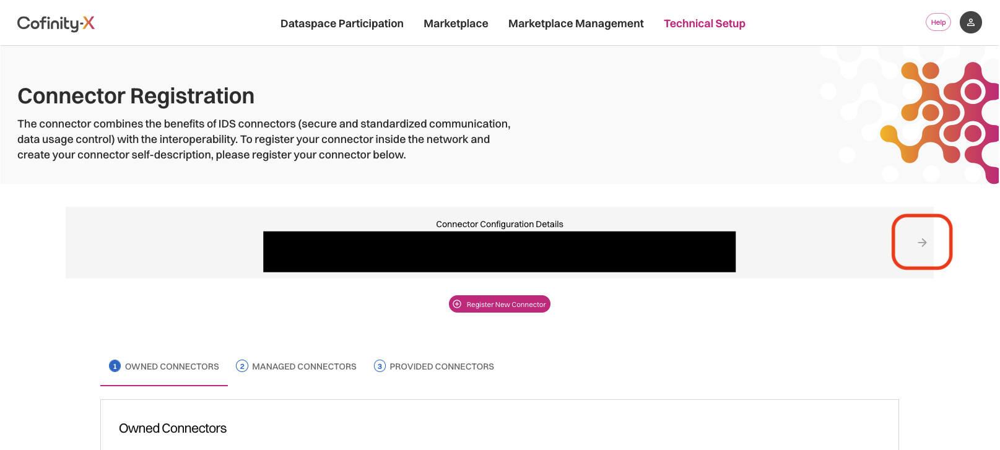
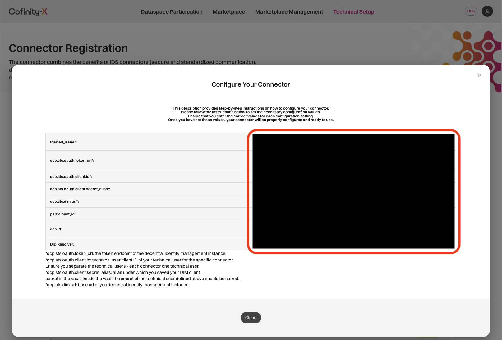

# Obtaining EDC Identity Credentials from the Cofinity-X Portal

This guide walks through retrieving the identity values *Dataspace Connector on AWS* needs from the Cofinity-X Portal [Beta](https://portal.beta.cofinity-x.com/) or [Production](https://myportal.cofinity-x.com/).

You gather two things here:

1. **Your organization's identity values**, entered once in the `portal.identity` section of [`deployment.yaml`](../README.md#deploymentyaml). They are the same for every connector.
2. **A technical user per connector**, created in the portal and referenced from [`connectors/connector-<id>.yaml`](../README.md#connectorsconnector-idyaml) by its **service account ID** (`edcTechnicalUserId`).

At deploy time the pipeline reads each technical user's OAuth client ID and secret from the portal, assembles the connector's EDC identity, stores the secret in AWS Secrets Manager, and registers the connector for discovery.

## Prerequisites

- Your organization is onboarded to the Catena-X data space
- You have access to the relevant Cofinity-X Portal instance (Beta or Production)

## Step 1: Navigate to Technical User Management

From the Cofinity-X Portal, open **Technical Setup** in the top navigation bar and select **Technical User Management**.



## Step 2: Create an External Technical User

Click the button to create a new technical user. In the creation dialog:

1. Enter a **Username** and **Description** that identify this connector (e.g., `edc-connector-a`)
2. Select **External technical user profile**
3. Under the external profile, select **Identity Wallet Management**
4. Click **Confirm**



> [!IMPORTANT]
> We recommend creating one dedicated technical user per EDC connector. Sharing technical users across connectors is possible but means those connectors share the same OAuth 2.0 credentials, which limits your ability to rotate secrets or revoke access independently.

Technical user creation takes a couple of minutes to complete.

## Step 3: Copy the Technical User's Service Account ID

Once the technical user is active, open its details page. Under **Technical User Details**, copy the value of the **ID** field. This is the service account ID that *Dataspace Connector on AWS* uses to look the user up in the portal at deploy time.



Set it as the `edcTechnicalUserId` in your `connectors/connector-<id>.yaml`:

```yaml
edcTechnicalUserId: "00000000-0000-0000-0000-000000000000"
```

You do not copy the Client ID or Secret. At deploy time the pipeline reads them from the portal, assembles the connector's EDC identity, and writes the OAuth client secret to AWS Secrets Manager.

## Step 4: Navigate to Connector Registration

The remaining identity values are located on the connector registration page. Open **Technical Setup** → **Connector Registration**.



## Step 5: Open Connector Configuration Details

On the Connector Registration page, click the **small arrow icon (→)** on the right side of the "Connector Configuration Details" section at the top to open the configuration values dialog.



## Step 6: Map Portal Values to `deployment.yaml`

The "Configure Your Connector" dialog displays your organization's identity values. These are the same for every connector, so you enter them **once** in the `portal.identity` section of [`deployment.yaml`](../README.md#deploymentyaml).



### Field Mapping

| Portal Field | `deployment.yaml` (`portal.identity`) | Description |
|---|---|---|
| `trusted_issuer` | `trustedIssuer` | DID of the trusted credential issuer |
| `dcp.sts.oauth.token.url` | `stsOauthTokenUrl` | Token endpoint of the DIM instance |
| `dcp.sts.dim.url` | `stsDimUrl` | Base URL of your DIM instance |
| `participant_id` | `participantId` | Your organization's Business Partner Number (BPN) |
| `dcp.id` | `dcpId` | Your organization's Decentralized Identifier (DID) |
| `DID Resolver` | `didResolver` | BPN/DID Resolution Service (BDRS) URL |

> [!NOTE]
> The dialog also shows `dcp.sts.oauth.client.id` and `dcp.sts.oauth.client.secret_alias`. You do **not** copy these. The OAuth client ID and secret belong to each connector's technical user and are read automatically by the pipeline (see Step 3).

## See Also

- [`deployment.yaml` configuration reference](../README.md#deploymentyaml)
- [`connectors/connector-<id>.yaml` schema](../README.md#connectorsconnector-idyaml)
